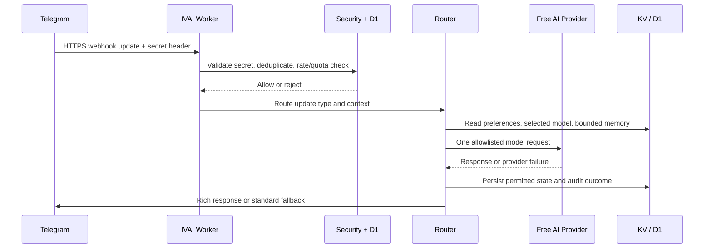

# IVAI v3.3 Architecture

IVAI is a single Cloudflare Worker that receives Telegram updates over a secret-protected webhook, processes each user request through a small set of focused ES modules, and persists state in Workers KV and D1. The architecture prioritizes predictable free-tier consumption: the normal response path makes one model request, and only tries the next configured free provider after a failure.

## Runtime components

| Component | Responsibility | State or boundary |
|---|---|---|
| `index.js` | Worker fetch entry point and scheduled handler | Rejects invalid webhook calls before routing; runs bounded background batches. |
| `security.js` | Webhook validation, update deduplication, rate/quota checks, roles | D1-backed atomic runtime guards. |
| `router.js` | Commands, callbacks, text/media updates, inline, Guest, reactions | Selects the minimum path necessary for each update. |
| `ai.js` | Provider policy, prompt assembly, sequential fallback | Workers AI primary; allowlisted free providers only. |
| `catalog.js` | Free-model catalog and picker | KV cache; selected model validation. |
| `telegram.js` | Telegram API calls, Rich Draft/Message fallback, UI and context forwarding | Preserves business and topic identifiers. |
| `storage.js` | User preferences, conversations, tasks, delivery state, audit data | D1 for relational state, KV for bounded memory/cache. |
| `media.js` | Telegram file retrieval, transcription, image analysis | Enforces size and quota limits before AI processing. |
| `broadcast.js` | Draft, preview, confirmation, queue and sequential deliveries | D1 audit trail; no paid broadcast flag. |
| `secretary.js` | Due-task claiming and reminder delivery | Atomic D1 claim prevents duplicate reminders. |
| `reengagement.js` | Consent-aware inactive-user check-ins | At-most-once-per-15-days eligibility and delivery tracking. |
| `admin.js` / `admin-page.js` | Validated Telegram Mini App administration | Server-side `initData` validation and role check. |

## Request lifecycle

## Scheduled lifecycle

The Worker runs every ten minutes. A single scheduled invocation performs only small bounded work: expired-state cleanup, a safe broadcast batch, due Secretary reminders, and a maximum of five re-engagement check-ins. Each delivery workflow claims work atomically in D1 before sending it, so concurrent Worker executions cannot deliberately send a duplicate delivery.

## Data ownership and retention

| Store | Use | Retention approach |
|---|---|---|
| D1 | Users, preferences, roles, task/reminder state, broadcast delivery/audit records, re-engagement consent | Structured operational state; migration-managed. |
| KV | Opt-in short-term conversation memory and catalog/cache values | TTL-bounded; users can inspect or clear memory. |
| Cloudflare Worker Secrets | Telegram token, webhook secret, admin IDs, optional provider keys | Never committed or returned by application routes. |

## Extension rules

New features should enter through the narrowest suitable module and keep failure behavior explicit. For example, a new command belongs in `router.js`, not in the fetch entry point; a D1 schema change is an ordered new migration; and a Telegram API enhancement must retain standard-message fallback. Any new provider must be reviewed against the free-only policy before it appears in the catalog or fallback chain.
