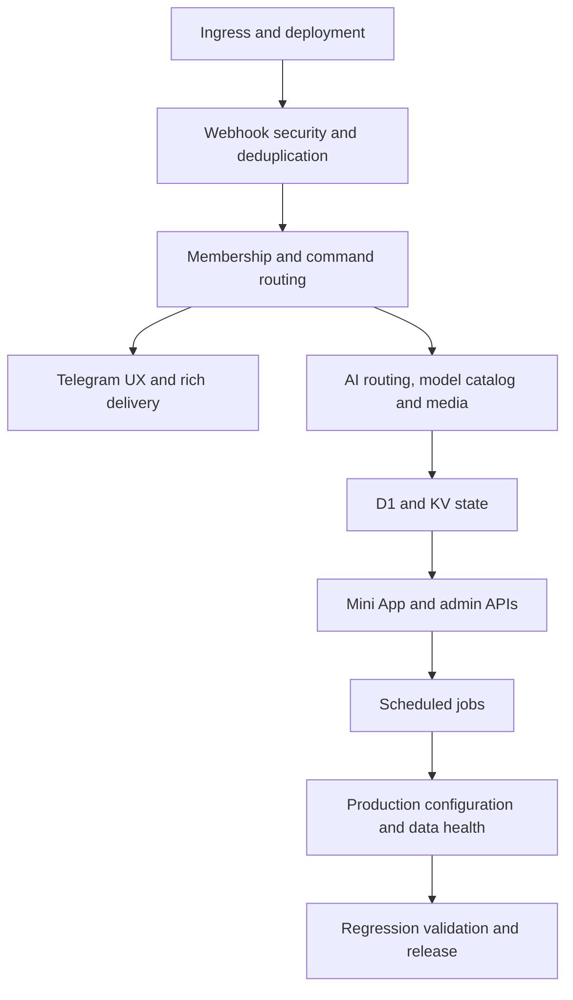

# IVAI Bot — Full Debug Map

**Scope:** End-to-end verification of the Telegram bot, Worker runtime, Cloudflare bindings, Mini App, background jobs and delivery paths.  
**Operating constraints:** Free-only AI routes, no Telegram Premium dependency, one successful provider call per AI turn, privacy-aware storage, and English-first UX.

## Debug matrix

| ID | Area | Core checks | Evidence required | Status |
|---|---|---|---|---|
| D01 | Build and configuration | Syntax, dependency audit, version consistency, Worker bindings | `pnpm run check`, audit, config review | Passed |
| D02 | Webhook boundary | Secret validation, idempotency, failure retry, non-POST rejection | Targeted regression tests | Passed |
| D03 | Access control | Required channel membership, callback recovery, fail-closed behavior | Membership tests and production configuration | Passed |
| D04 | Commands and Telegram UX | Start, Menu, language, model picker, rich HTML, long replies, terminal button | Regression tests and static UI assertions | Passed |
| D05 | AI and model policy | Provider priority, selected model, zero-price catalog, output limits, fallback | Unit simulations and policy review | Passed |
| D06 | Media and context | Image/voice limits, context routing, memory, inline and guest flows | Regression tests and code-path review | Passed |
| D07 | State and data | D1 upserts, KV TTL, atomic claims, preference persistence | Storage tests and aggregate D1 health queries | Passed |
| D08 | Mini App and admin | Authentication, API rejection paths, CSP, Terminal bootstrap, admin authorization | Regression tests and live endpoint probes | Passed |
| D09 | Scheduled jobs | Cron registration, broadcast, Secretary, re-engagement, retry and overlap safety | Cron configuration, simulation and D1 health | Passed |
| D10 | Production | Worker deployment, endpoint health, D1/KV bindings, deployed schedules | Cloudflare read-only verification | Passed |
| D11 | Release gate | Full regression suite, audit, diff hygiene, CI/build status | Test, audit and CI results | Passed (local; CI pending) |

## Pass criteria

A component passes only when its expected behavior is covered by an automated test or deterministic simulation, no security boundary is bypassed, its production configuration is confirmed where applicable, and no unrepaired high-severity defect remains. Any confirmed defect is recorded with its cause, remediation and regression test.

## Execution log

| Timestamp | Area | Result | Evidence / action |
|---|---|---|---|
| 2026-08-21 | Planning | Started | Full matrix defined; findings will be appended during execution. |
| 2026-08-21 | D01 — Build and configuration | Passed | `node --check src/*.js` completed without syntax errors; all 17 runtime modules are present; `git diff --check` is clean; production audit found no high-severity vulnerability; offline frozen-lockfile install is reproducible; KV, D1, AI and `*/10` cron bindings match the Worker config. |
| 2026-08-21 | D02 — Webhook boundary | Passed | Secret validation, exact-match rejection, retry-safe claim release and transient Telegram failure behavior all passed targeted simulation. |
| 2026-08-21 | D03 — Access control | Passed | ID lookup, username fallback, fail-closed membership handling, successful check callback and no-prompt path for verified members passed. |
| 2026-08-21 | D04 — Telegram UX | Passed | Start/Menu separation, localized language picker, persistent Terminal button, HTML Rich Draft fallback and complete long-response chunk delivery passed. Expected simulated failure logs were caught safely. |
| 2026-08-21 | D05 — AI and model policy | Passed | Budget guard, bounded output, selected Workers AI model priority, zero-price OpenRouter admission, picker callback and one-call guest/Terminal flows passed. |
| 2026-08-21 | D06 — Media and context | Passed | Voice/photo path sends one guarded Workers AI call per medium; oversized metadata is rejected before a binary download; media data URL construction, topic/business context, guest and inline paths passed. |
| 2026-08-21 | D07 — State and data | Passed | Atomic language upsert, scoped memory cleanup, free-budget counter, webhook claims and re-engagement D1 claim behavior passed deterministic simulation. |
| 2026-08-21 | D08 — Mini App and admin | Passed | Admin/API authentication rejection, authorized read-only operations summary, Terminal CSP/same-origin response, rendered bootstrap, membership gate, prompt validation and method rejection all passed. |
| 2026-08-21 | D09 — Scheduled jobs | Passed | Cron route is registered; broadcast seeding snapshots recipients beyond 250 while excluding late arrivals; broadcast/Secretary retry limits and re-engagement single-claim/overlap behavior passed. |
| 2026-08-21 | D10 — Production endpoints | Passed | `https://ivai-bot.ivai-bot.workers.dev/` returned `IVAI Worker is ready.`; `/app` served the navy/blue/jade IVAI Terminal shell with Reconnect, message input and explicit in-Telegram secure-session guidance. No unauthenticated message was sent. Cloudflare confirms Worker `ivai-bot`, D1 `ivai_db` with 15 tables, KV `IVAI_KV`, and production schedule `*/10 * * * *`. The aggregate D1 health query succeeded without reading personal data: 3 users, 3 chats, zero pending broadcasts and no stuck state. |
| 2026-08-21 | D11 — Release gate | Passed (local) | Full suite: 54 passed, 0 failed; `git diff --check` clean; production dependency audit reports no known high-severity vulnerability. GitHub CI and Workers build will be confirmed after push. |
